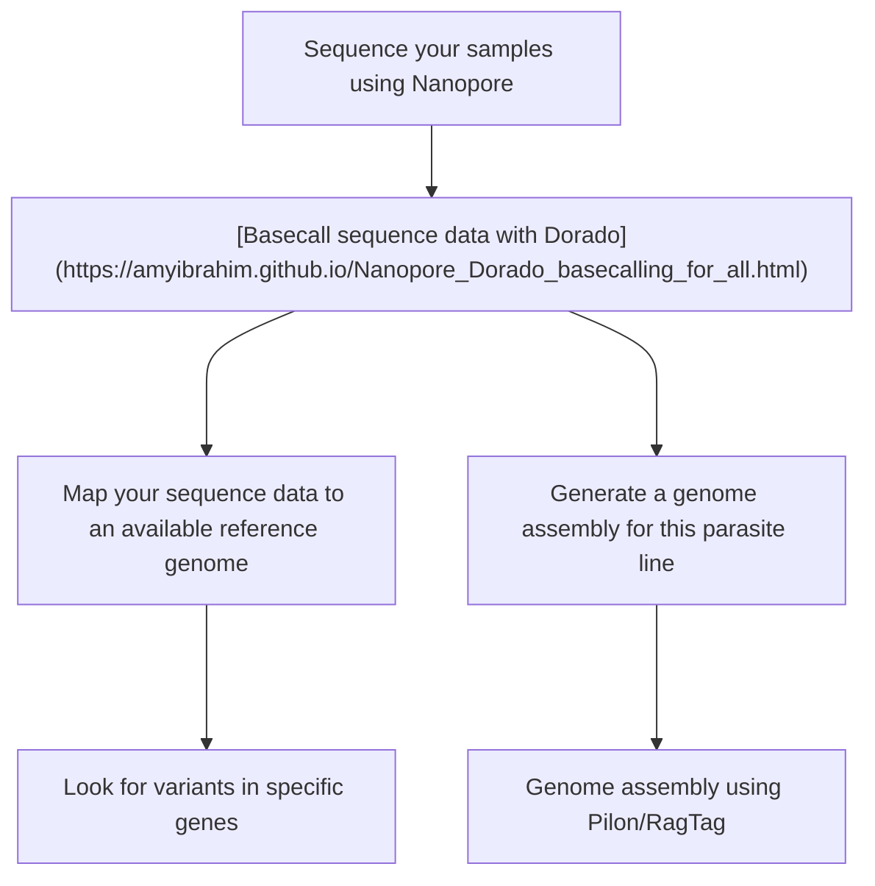

<!--# amyibrahim.github.io -->
<!-- This is commented out. -->

Amy Ibrahim

Research Fellow

Moon Group, LSHTM, London

## Research

I work within the Moon Group at LSHTM investigating how the inrtacellular parasite, _Plasmodium knowlesi_ invades human erythrocytes. My research is funded under a Wellcome Trust Discovery Award. I use CRISPR-Cas9 based genome editing to target known and unknown genes associated with erythrocyte invasion and investigate parasite phenotypes. 

Previously, I have worked on whole genomoe sequencing for malaria parasites, using both Illumina and Oxford Nanopore systems, and I use the Nanopore MinION frequently to assess the genomics of modified parasite lines.

## Associated publications

- Ibrahim, A. et al. **[Genome sequencing of Plasmodium malariae identifies continental segregation and mutations associated with reduced pyrimethamine susceptibility.](https://www.nature.com/articles/s41467-024-55102-3)** Nature communications. 15, 10779 (2024).

- Ibrahim, A. et al. **[Population genomic study of Plasmodium vivax malaria in seven Brazilian states and across South America.](https://www.thelancet.com/journals/lanam/article/PIIS2667-193X(22)00237-X/fulltext)** Lancet Reg. Heal. - Am. 18, 100420 (2023).

- Ibrahim, A. et al. **[Selective whole genome amplification of Plasmodium malariae DNA from clinical samples reveals insights into population structure.](https://www.nature.com/articles/s41598-020-67568-4)** Sci Rep. 10, 10832 (2020). 

## Lab Training
[Molecular Biology](./Molecular_biology.html) 

[Guide design](./Guides.html) 

## Computational Training

[Initial computer set up for coding - mac users](./Computational_setup_mac.md)

[Initial computer set up for coding - windows users](./Computational_setup_windows.md)

[Initial computational set up for coding - Linux servers](./computational_setup_Linux_server.md)

[Nanopore analysis for custom barcodes](./Nanopore_analysis_barcodes.md) 

[Nanopore analysis for genome assembly](./Nanopore_analysis_genome_assembly.html/)

[Nanopore basecalling using Dorado (basic)](./Nanopore_Dorado_basecalling_for_all.md/)

## Misc
[Aids whilst PlasmoDB is down](./PlasmoDB_aids.html/)

